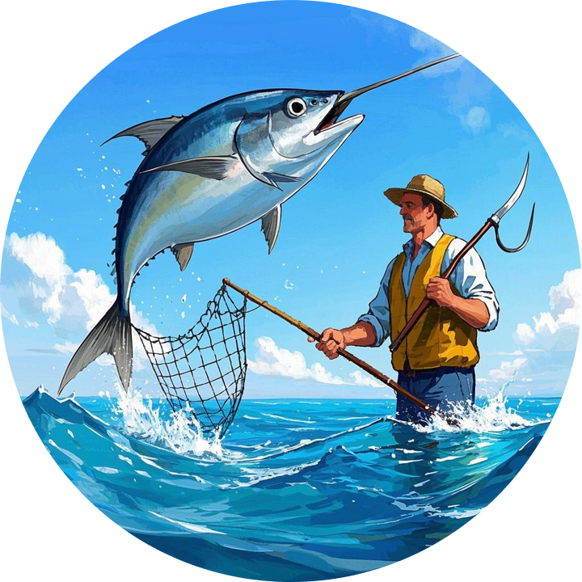

# 捕鱼小游戏
这是一个利用`pygame`模块制作的捕鱼小游戏，玩家可以通过键盘控制渔夫移动，左键发射渔叉攻击鱼类，右键发射渔网捕捉鱼类。


图像size变为50%



## 1. 环境安装
推荐使用conda创建虚拟环境并部署。

```bash
conda create -n fishman python=3.12
conda activate fishman
pip install -r requirements.txt
```

然后运行：
```bash
python src/main.py
```
即可启动游戏。

## 2. 基本玩法
玩家控制AD键移动船只，左键发射渔叉攻击鱼类，右键发射渔网捕捉鱼类。在海岸按W出售鱼类。

待补充：
## 3.配置说明

## 4.实现逻辑